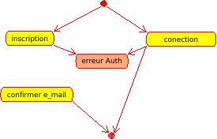
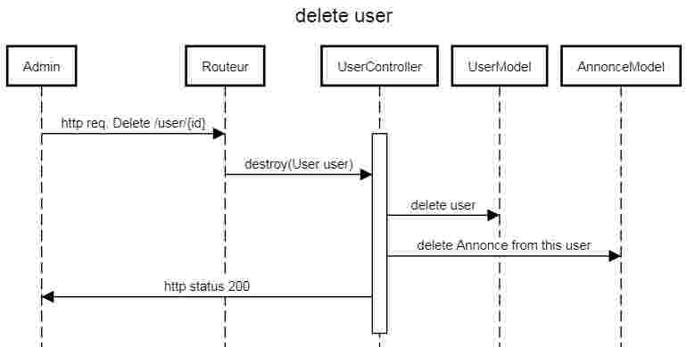

## Documents de conception

---

### user stories

#### en tant qu'internaute je peux:
* m'inscrire
* consulter les annonces
* filtrer les annonces
* contacter un auteur d'annonce

#### en tant qu'utilisateur enregistré je peux:
* consulter messages
* gerer mes annonces (desactiver, modifier)
* creer une annonce

#### en tant qu'admin je peux:
* gerer les utilisateurs (desactiver) 
* gerer les annonces (desactiver) 

### use case

### entité association

### diagrame d'etat

authentification:

### diagramme de sequence 

* delete user

